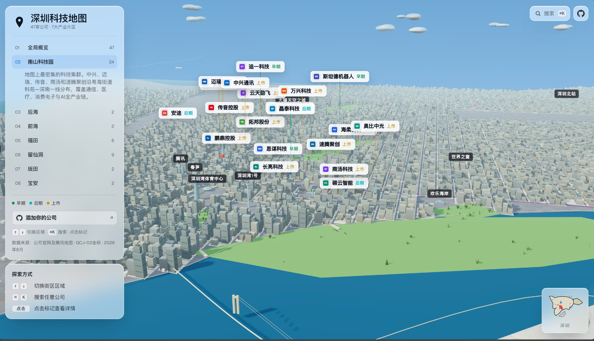

# 深圳科技地图 Shenzhen Tech Map

[🌐 在线访问](https://shenzhen-map.netlify.app) · 深圳科技公司的高保真 3D 交互地图。



渲染一个可探索的深圳城市场景，包含公司标记、企业 Logo、片区导航、城市地标、地铁线路、车辆动画和可搜索的公司索引。

交互模型灵感来自 [Levels.fyi Atlas](https://www.levels.fyi/atlas)：左侧片区导航、相机飞行、可点击的公司标签，以及场景中的实时动态元素。

## 项目来源

本项目基于 [NYC AI Atlas](https://github.com/Nutlope/nyc-ai-atlas) 改造，原始作者是 [Nutlope](https://github.com/Nutlope)。

原始项目是一个纽约市 AI 创业生态的 3D 交互地图。本项目将其改造为深圳科技地图，替换了全部地理数据、公司数据和城市地标，并将界面翻译为中文。

在此向原作者表示感谢。

## 地图内容

- 47 家科技公司，分布在南山科技园、留仙洞、后海、前海、福田、坂田和宝安七大产业片区。
- 7 个可飞行的地图视角：全局概览、南山科技园、留仙洞、后海、前海、福田、坂田、宝安。
- 公司标签使用 SVG Logo（`public/logos`）。
- 公司详情卡显示阶段、行业、办公类型、官网和简介。
- 深圳城市图层：地标建筑（平安金融中心、春笋、京基100、腾讯滨海大厦、腾讯企鹅岛、大疆天空之城、深圳会展中心、深圳证券交易所等 18 座）、地铁线路、桥梁、车辆动画、小地图。
- 坐标系统：GCJ-02（火星坐标系），与高德/腾讯地图一致。

## 3D 地图

本项目是一张**真正的 3D 地图**，而非静态图片或 2D 图表：

- **实时 WebGL 渲染**：基于 [Three.js](https://threejs.org/) 在浏览器中实时绘制深圳城市场景，可流畅旋转、缩放、平移。
- **3D 透视与相机飞行**：摄像机可在全局概览与七大产业片区之间带高度地平滑飞行，呈现真实的 3D 城市纵深。
- **3D 建筑与地标**：公司、地标均以三维建筑体呈现，包含玻璃幕墙材质、屋顶细节、阴影与夜间灯光。
- **动态城市元素**：地铁列车、地面车辆、行人等实时动画让场景保持"活"的状态。
- **交互式探索**：支持鼠标/触摸拖拽旋转、滚轮缩放、点击标记查看公司详情，并可通过左侧导航或 `⌘K` 搜索快速定位。

## 技术栈

- Vite
- Three.js
- Vanilla JavaScript modules
- CSS custom properties
- Geist 字体（SIL OFL）

无 React、无后端服务。场景构建在 [src/main.js](src/main.js)，地理数据在 [src/geo.js](src/geo.js)，公司数据在 [src/data.js](src/data.js)，样式在 [src/styles.css](src/styles.css)。

## 快速开始

安装依赖：

```sh
pnpm install
```

启动开发服务器：

```sh
npm run dev
```

构建生产版本：

```sh
npm run build
```

预览生产版本：

```sh
npm run preview
```

## 项目结构

```text
.
├── index.html          # 页面骨架、SEO、HUD 布局
├── package.json
├── vite.config.js      # 固定端口 5190
├── public/
│   ├── fonts/          # Geist 字体
│   └── logos/          # 公司 SVG Logo
├── scripts/
│   ├── fetch-logos.mjs
│   ├── generate-address-report.mjs
│   ├── verify-coords.mjs
│   └── minimap-paths.mjs
├── src/
│   ├── data.js         # 公司数据、区域定义
│   ├── geo.js          # 深圳地理数据（海岸线、地标、地铁、建筑区）
│   ├── main.js         # Three.js 场景、渲染、交互
│   └── styles.css      # 样式
└── tokens.css          # CSS 变量定义
```

## 坐标系统

所有地理坐标使用 GCJ-02（火星坐标系），与高德地图、腾讯地图一致。百度地图使用 BD-09（二次加密），如需对比需先转换。

投影函数 `project(lat, lng, y)` 位于 `src/main.js`，将 GCJ-02 经纬度转换为 Three.js 世界坐标。

## 致谢

- 原始项目：[NYC AI Atlas](https://github.com/Nutlope/nyc-ai-atlas) by [Nutlope](https://github.com/Nutlope)
- 交互模型灵感：[Levels.fyi Atlas](https://www.levels.fyi/atlas)
- 字体：[Geist](https://github.com/vercel/geist-font) by Vercel (SIL OFL)
- 3D 渲染：[Three.js](https://threejs.org/)
